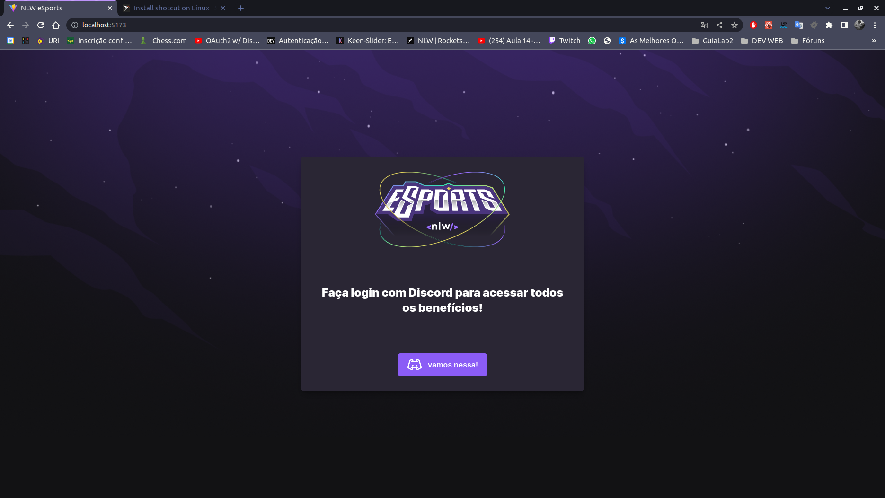
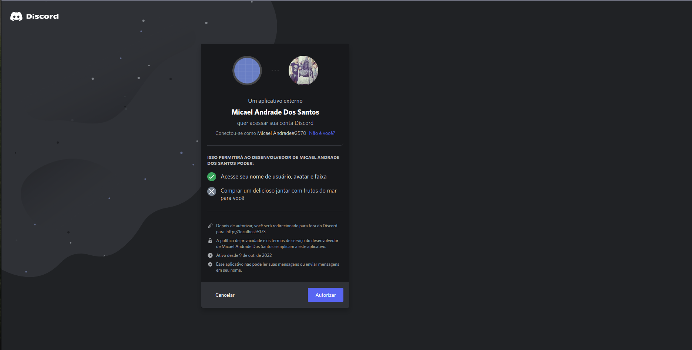
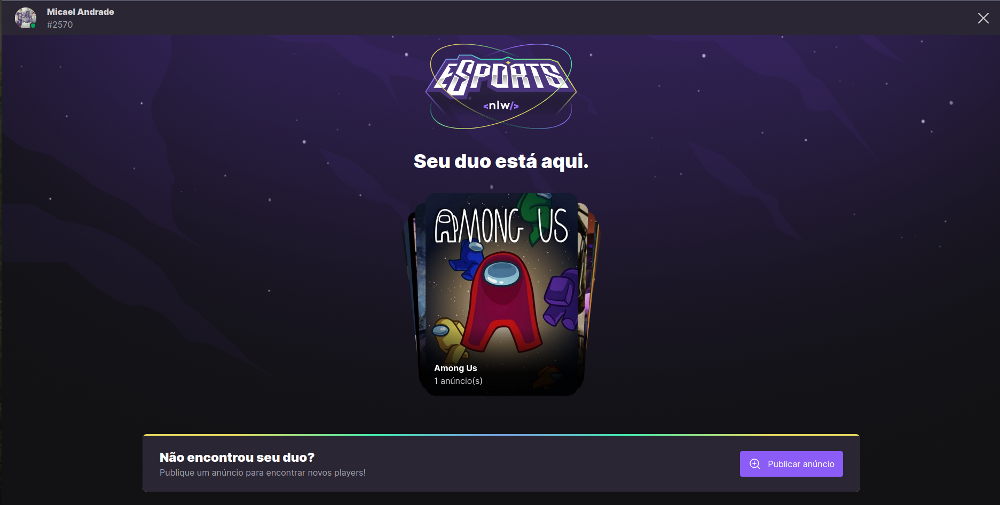
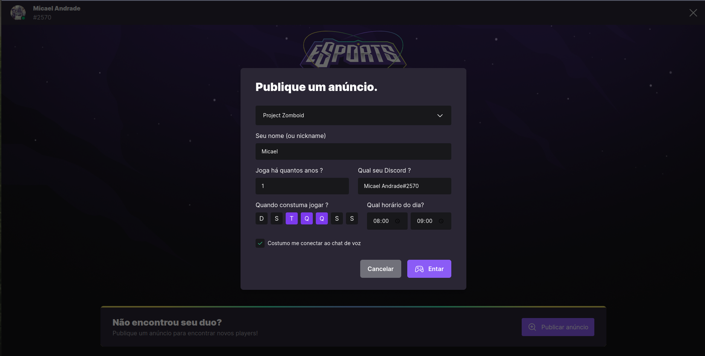
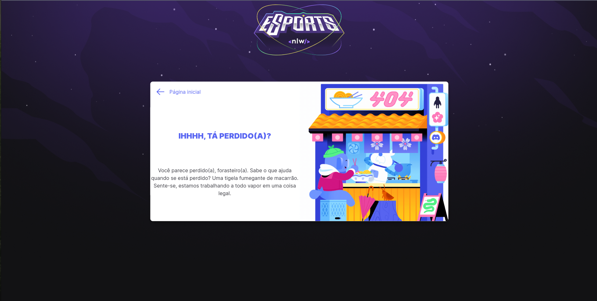
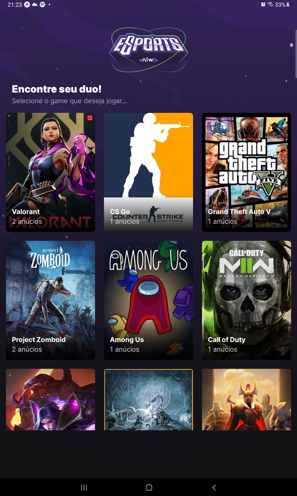
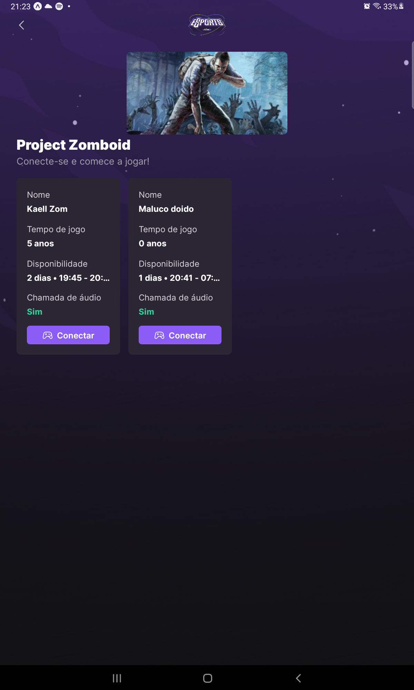

# NLW-Ignite

## Anotações

1. [x] [Aula 01 - Base Building](aula01)
2. [X] [Aula 02 - High Speed](aula02)
3. [X] [Aula 03 - To be continued](aula03)
4. [X] [Aula 04 - Power up](aula04)
5. [X] [Aula 05 - Final Round :rocket:](aula05)

# Telas

## WEB

<table>
  <tr>
    <td>
      <figure>
        
        <figcaption>Tela de login com Discord</figcaption>
      </figure>
    </td>
    <td>
      <figure>
        
        <figcaption>Integração com Discord</figcaption>
      </figure>
    </td>
    <td>
      <figure>
        
        <figcaption>Home web para cadastrar anúncios</figcaption>
      </figure>
    </td>
  </tr>
  <tr>
    <td>
      <figure>
        
        <figcaption>Modal para cadastrar anúncios</figcaption>
      </figure>
    </td>
    <td>
      <figure>
        
        <figcaption>Tela 404</figcaption>
      </figure>
    </td>
  </tr>
</table>

## Mobile
<table>
  <tr>
    <td>
      <figure>
        
        <figcaption>Home mobile</figcaption>
      </figure>
    </td>
    <td>
      <figure>
        
        <figcaption>Listagem anúncios</figcaption>
      </figure>
    </td>
    <td>
      <figure>
        
        <figcaption>Modal para discord do jogador</figcaption>
      </figure>
    </td>
  </tr>
</table>
